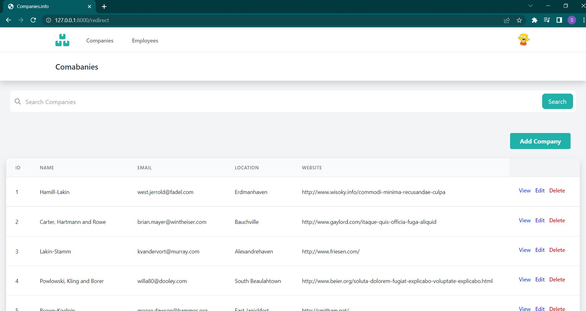

# Laravel_CRUD
This is a simple laravel app with CRUD, multi authentication (admin and user), and live search.

### Admin View
CRUD operation to manage Companies and their employees - create/edit/update/delete.

### User View

---

## How to install and run on your local system

- Clone the repository with __git clone__
- Run __composer install__
- Copy __.env.example__ file to __.env__ and edit database credentials there
- Run __php artisan key:generate__
- You Have two options here
  - first one:
    - import the database from the TO_USE folder
    - To access the admin view you can use:
      email: celia47@example.net
      password: password
    - To access the user view you can use:
      email: alek65@example.net
      password: password
  - second one  
    - Run __php artisan migrate --seed__
    - Go to your database and change one of their roles to 1 to be your admin.
    - use them to access your views (the password is always password)
- Run __npm install__
- Run __npm run dev__
- Run __php artisan serve__ (if the server opens up, http://127.0.0.1:8000, then you are good to go)

---

### License

Please use and reuse however you want.

---

## Resources
- All of the logos are from: [freepik](www.freepik.com)
- Some of the front-end templates are form [laragigs_theme](https://github.com/bradtraversy/laragigs/tree/main/_laragigs_theme)
- Profile photos of the users are characters of [The Simpsons](https://g.co/kgs/b79Z4V)
- If you are still learning, Here are some videos that were helpful while making this project:
    - [CRUD](https://www.youtube.com/watch?v=MYyJ4PuL4pY&t=12197s)
    - [Multi Auth](https://www.youtube.com/watch?v=-9tUWhNmQz4&t=1170s)
    - and of course laravel documentation.
